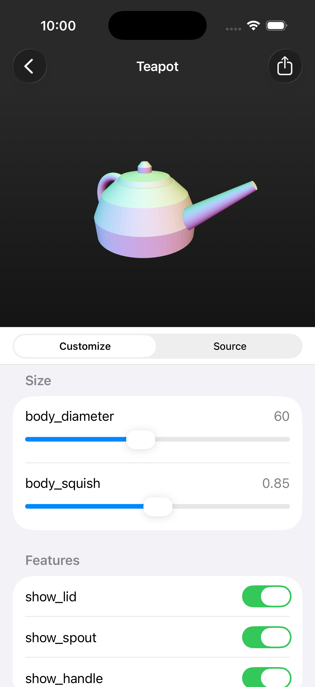
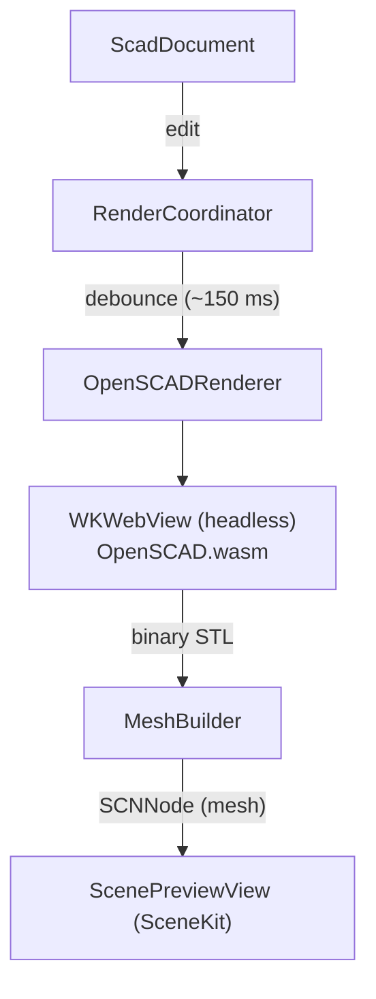

# OpenSCAD Editor for iOS

A SwiftUI app that edits [OpenSCAD](https://openscad.org) `.scad` source on an
iPhone or iPad, compiles it to a mesh **on-device**, and shows a live, orbitable
3D preview. No server, no network — the OpenSCAD engine runs as WebAssembly
inside the app.



## Features

- **Live preview.** Edits are debounced (~150 ms) and recompiled automatically;
  the rendered mesh updates in place while the camera keeps its framing.
- **Customizer parameters.** Top-level assignments annotated in OpenSCAD's
  [Customizer](https://en.wikibooks.org/wiki/OpenSCAD_User_Manual/Customizer)
  syntax (`// [min:max]`, dropdown option lists, `/* [Group] */` headers) become
  native sliders, steppers, toggles, and pickers.
- **Orbit / pinch / pan** 3D preview with a three-light rig and screen-space
  ambient occlusion so parts read with depth. Faces are shaded by orientation
  (the classic "normal material").
- **Projects list** with an auto-rendered thumbnail per project.
- **Export** from the editor's share menu — the latest successful render as an
  `.stl` mesh, or the current `.scad` source — each handed to the system share
  sheet (save to Files, AirDrop, open in a slicer, …).
- **iCloud sync** when the iCloud entitlement is present on a signed build;
  otherwise projects live in the local Documents directory and everything else
  still works.

## How it works

OpenSCAD is compiled to WebAssembly and hosted headlessly in an off-screen
`WKWebView`. Swift hands it `.scad` source and gets binary STL back; nothing is
ever displayed in the web view.



Key pieces:

- **`OpenSCADRenderer`** / **`Web/index.html`** — the engine host. A custom
  `oscad://` URL scheme (`BundleSchemeHandler`) serves the bundled engine assets
  with correct MIME types, since `file://` can't return `application/wasm`. Each
  OpenSCAD runtime calls `exit()` after one render, so the page keeps the *next*
  instance warming while the current one runs.
- **`RenderCoordinator`** — debounces edits, runs one render at a time, and
  publishes the resulting `SCNNode` + status + a shareable STL file URL.
- **`MeshBuilder`** — parses binary/ASCII STL into SceneKit geometry. It rotates
  the mesh −90° about X because OpenSCAD/STL is Z-up while SceneKit is Y-up, so
  models stand upright.
- **`ScadParser`** — parses Customizer parameters using
  [`swift-parsing`](https://github.com/pointfreeco/swift-parsing) combinators
  (no regex).
- **`ThumbnailRenderer`** — renders the projects-list thumbnails off screen with
  the same light rig as the live preview.

## Requirements

- Xcode 16+
- iOS 17.0+ deployment target
- Swift 5

The only external dependency is `swift-parsing`, resolved via Swift Package
Manager (already pinned in `Package.resolved`).

## Build & run

```bash
open OpenSCADEditor.xcodeproj
```

Select the **OpenSCADEditor** scheme and run on a simulator or device. Xcode
resolves the package dependency on first build.

The WebAssembly engine (`OpenSCADEditor/Web/openscad.wasm` and its glue) is
checked into the repo and bundled into the app — there's no separate engine
build step.

## Project layout

```
OpenSCADEditor/
  Model/      Rendering, parsing, and storage
  Views/      SwiftUI screens (projects list, editor, 3D preview, controls)
  Web/        Bundled OpenSCAD WebAssembly engine + host page
  Samples/    Seed .scad documents (Teapot)
.github/workflows/testflight.yml   CI: build, artifact, TestFlight upload
```

## TestFlight (CI)

`.github/workflows/testflight.yml` runs on every push to `main` (and on demand).
It archives a signed Release build, uploads the `.ipa` as a downloadable
workflow artifact, and ships it to TestFlight.

Signing and upload use App Store Connect API-key auth, so nothing personal is
committed. Before the workflow can succeed you need an Apple Developer account
with the app registered, and these five repository **secrets** set:

| Secret | What it is |
| --- | --- |
| `APPLE_TEAM_ID` | Your Apple Developer Team ID |
| `IOS_BUNDLE_ID` | The app's registered bundle identifier |
| `ASC_KEY_ID` | App Store Connect API key ID |
| `ASC_ISSUER_ID` | App Store Connect API issuer ID |
| `ASC_API_KEY_P8` | Contents of the `AuthKey_XXXX.p8` file |

Until those are set, the run fails at the signing step — that's expected, not a
config error.
